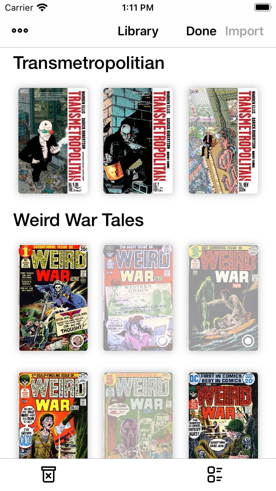
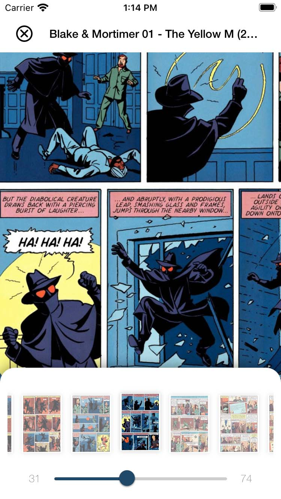
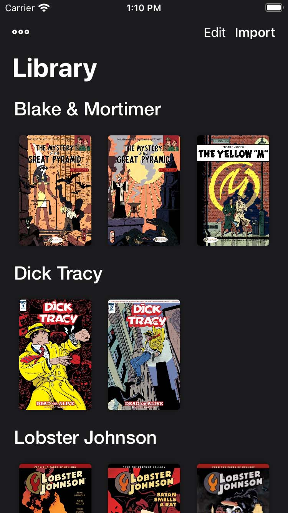
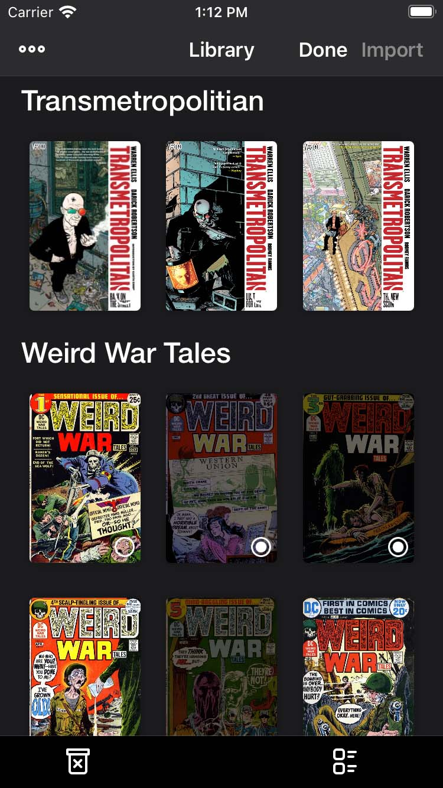
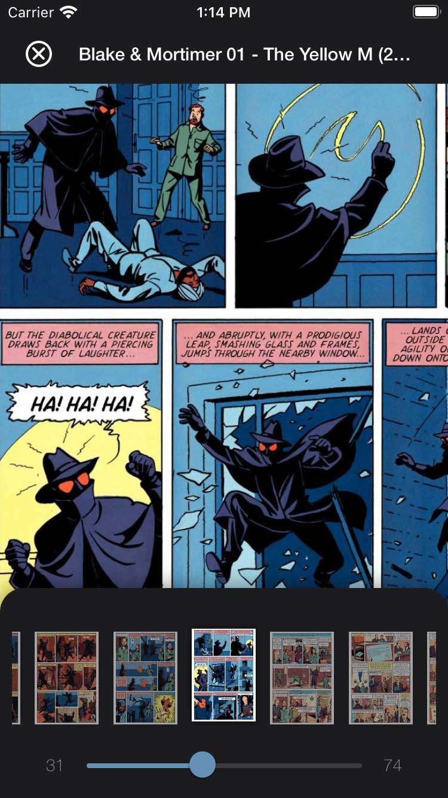
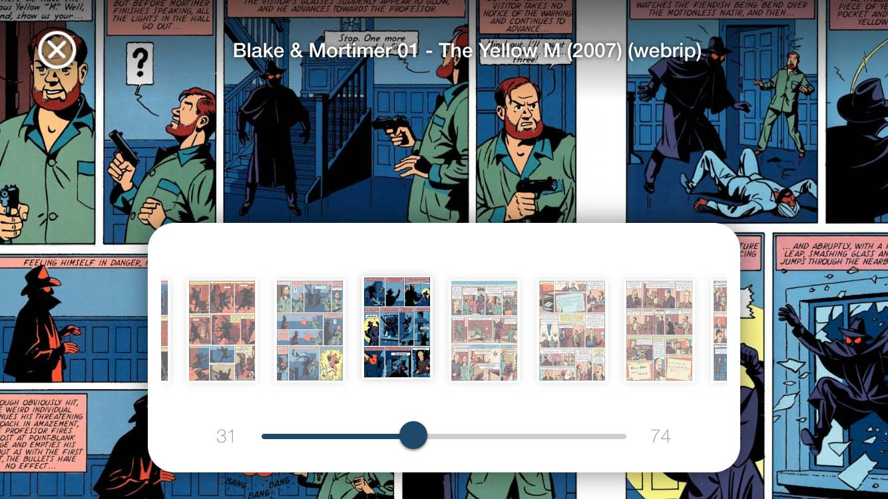
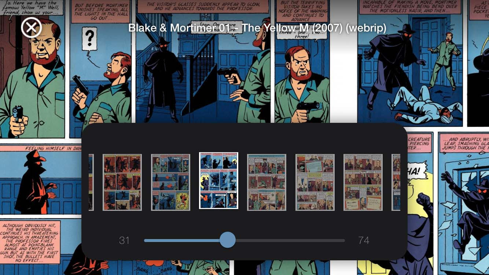

# ComicKhan - CBZ/CBR/PDF Reader

ComicKhan is an app for reading your comic files (.cbz /.cbr/.pdf) on your iPhone and iPad.

## Screenshots

<table>
<tr>
<td></td>
<td></td>
<td></td>
</tr>

<tr>
<td></td>
<td></td>
<td></td>
</tr>

</table>
<table>
<tr>
<td></td>
<td></td>
</tr>

</table>

## Features
* Detects new comic files when you add them into the document directory and start extracting them while showing their extraction progress.
* Read your comics in double page and single page based on your device orientation.
* Stores the last page that you have read and show reading progress with a circular progress view on the left bottom corner of each book in your library.
* Resizes comic images for smooth scrolling and better performance.
* Group your comics and organize them in the library.

## TODO
- [x] Support for comics with PDF format
- [x] Support for extracting directories of comics.
- [ ] Switch between dark mode / light mode in book reader without needing to change the system color preferences.
- [ ] Ability to sort comic groups based on name, date added, etc.

## Credits
* Thanks to [GianniCarlo](https://github.com/GianniCarlo/DirectoryWatcher) for directory watcher.
* Thanks to [abbeycode](https://github.com/abbeycode/UnrarKit) and [marmelroy](https://github.com/marmelroy/Zip) for compressed files extraction. 
* Thanks to [BilekUI](https://twitter.com/BilekUI) for icons and [icone8](https://icons8.com) for illustrations.
