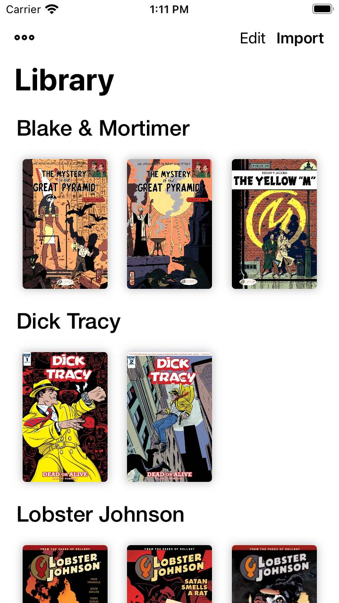

# ComicKhan - CBZ/CBR/PDF Reader

*Notice:
Unfortunately, during the past few years a lot has happened in my life and I couldn't maintain this repo and project properly. At the same time the codebase has become a bit old and I believe any possible feature development or bug fixing is really difficult right now. I decided to archive this repo.
But regardless of that, I am still willing to work on this project. In the feature, if the life becomes easier and I have the time, I am definitely looking forward to planning a rewrite using newer frameworks like swiftUI and async await and probably try to reuse bunch of components from here.*

ComicKhan is an app for reading your comic files (.cbz /.cbr/.pdf) on your iPhone and iPad.

## Screenshots

<table>
<tr>
<td></td>
<td></td>
<td></td>
</tr>

<tr>
<td></td>
<td></td>
<td></td>
</tr>

</table>
<table>
<tr>
<td></td>
<td></td>
</tr>

</table>

## Features
* Detects new comic files when you add them into the document directory and starts extracting them while showing their extraction progress.
* Allows you to reading your comics in double pages or single page based.
* Stores the last page you have read and displays its reading progress on each book in your library.
* Resizes comic images for smooth scrolling and better performance.
* Allows you to group your comics and organize them in the library.

## TODO
- [x] Support for comics with PDF format
- [x] Support for extracting directories of comics.
- [X] Switch between dark mode / light mode in book reader without needing to change the system color preferences.
- [ ] Ability to sort comic groups based on name, date added, etc.

## Credits
* Thanks to [GianniCarlo](https://github.com/GianniCarlo/DirectoryWatcher) for directory watcher.
* Thanks to [abbeycode](https://github.com/abbeycode/UnrarKit) and [marmelroy](https://github.com/marmelroy/Zip) for compressed files extraction. 
* Thanks to [BilekUI](https://twitter.com/BilekUI) for icons and [icone8](https://icons8.com) for illustrations.
